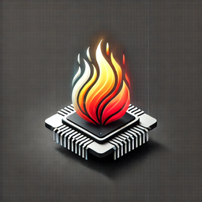

# LeaderPort



[leaderport.xyz](https://leaderport.xyz) is a comprehensive real-time ranking and leaderboard platform, delivered through three main channels:

1. **Web Application**
   - Instant access to public leaderboards
   - Web3 wallet integration for premium features
   - Real-time sports, markets, and competitive data

2. **Browser Extensions**
   - Transform your browser into a command center
   - Instant leaderboard updates
   - Cross-platform achievement tracking

3. **Mobile Applications**
   - Native iOS and Android experiences
   - Real-time notifications
   - On-the-go leaderboard access

By taking a platform-first approach, LeaderPort transforms raw data into actionable insights across sports, markets, and competitive landscapes. Whether you're tracking top-performing stocks, leading sports scores, trending cryptocurrencies, or competitive metrics, LeaderPort serves as your all-in-one portal to performance leadership.

Our Web3 integration allows users to connect their Sui Wallet (and other supported wallets in the future) to access premium features, integrate with Web3 games/achievements, and make blockchain-enabled transactions. For more details on our Web3 strategy, check out our [Web3 Vision](docs/web3-vision.md).


The platform will initially support [Sui](https://sui.io/), the first internet-scale programmable blockchain platform, for Web3 features. Depending on developer demand and community consensus we will consider supporting other blockchains and wallets.

## Achievement System

1. **Permanent Record Keeping**
   - Immutable blockchain storage of significant achievements
   - Historical leaderboards preserved indefinitely
   - Verifiable proof of accomplishment
   - Cross-platform achievement persistence

2. **NFT Achievement System with SuiFrens**
   - Dynamic NFT minting for major milestones
   - Rarity tiers based on achievement difficulty
   - Tradeable digital collectibles
   - Achievement showcase functionality
   - SuiFrens Integration:
     - Customizable SuiFren characters as achievement badges
     - Progressive trait unlocks based on milestones
     - Community-driven rarity system
     - Cross-platform achievement display
     - Interoperable with SuiFrens ecosystem

Please reference the [SuiFrens Integration](docs/sui-frens.md) doc for detailed implementation info.

3. **Community Validation**
   - Decentralized verification of major records
   - Community voting on achievement authenticity
   - Transparent validation processes
   - Anti-cheat mechanism integration
   
Please reference the [Web3 vision](docs/web3-vision.md) doc for more detailed info.

## Storage with Walrus


LeaderPort products will use [Walrus](https://docs.walrus.site/) for decentralized storage of achievement data and related assets. Walrus is specifically designed for storing large binary files ("blobs") on the Sui network.

### Key Features
- Decentralized storage with Sui blockchain integration
- Cost-efficient storage using advanced erasure coding
- Public accessibility of stored data
- Native WAL token integration for storage payments

### Important Notes
- All stored data is public and discoverable
- Currently in Testnet phase - not recommended for production use
- Uses Testnet WAL and SUI tokens (no real value)
- Storage state may be wiped during Testnet

### Potential Use Cases
- Storing achievement badges/images
- Backing up achievement metadata
- Storing leaderboard historical data

### Setup Requirements
1. Testnet WAL tokens for storage operations
2. Integration with Sui wallet for transactions
3. Proper error handling for storage operations

## LeaderPort concept

Core Definition: LeaderPort is your universal gateway to real-time rankings and leaderboards, transforming raw data into actionable insights across sports, markets, and competitive landscapes.

Key Messaging Points:
- The "Port" in LeaderPort suggests both a gateway/portal and a place where important information docks/arrives
- It serves as a central hub where different types of leadership data converge
- Works across multiple domains:
  - Sports: "Track champions across every league"
  - Markets: "Monitor market movers and top performers"
  - Crypto: "Real-time crypto rankings and momentum"
  - Education: "Leadership boards for learning achievements"
  - Fitness: "Top performer tracking for health goals"
  - Business: "Sales leaderboards and performance metrics"

Product Description: LeaderPort transforms your browser into a command center for real-time rankings. Whether you're tracking top-performing stocks, leading sports scores, trending cryptocurrencies, or competitive metrics, LeaderPort serves as your all-in-one portal to performance leadership. With customizable dashboards and instant updates, you'll always know what's leading the pack across any domain that matters to you.

Marketing Hook: In a world of endless data, LeaderPort is your compass to what's winning. From Wall Street to the World Series, never miss a leader in motion.

## Browser Extension Strategy

LeaderPort's browser extensions will leverage public APIs the backend will provide real-time data visualization and insights.

- **Data Integration**: Connects to LeaderPort's backend API which aggregates data from official sources 
- **Smart Caching**: Utilizes `chrome.storage` for data caching and user prefs, respecting subscription tiers
- **Interactive Visualization**: Integrates Highcharts for professional-grade charts and dashboards
- **Real-time Updates**: SSE/WebSocket connections for live data streaming based on subscription level
- **User Interface**: Displays data in a `chrome.sidePanel` with progressive loading and offline support
- **Subscription Management**: Handles user authentication and feature access based on subscription tier

For a detailed strategy and API integration details, refer to the [Sports Data Integration Guide](./docs/sports-data.md).

For development workflow, refer to [Extension Development](./docs/extension-dev.md)


## Leaderboard Use Cases

Primarily designed for Web3 gaming and competitive dApps, with extensibility to traditional applications:

### Web3 Gaming & NFTs
- Sui Ecosystem Games: Track player achievements, rankings, and in-game asset performance
- NFT Collection Rankings: Monitor floor prices, trading volume, and holder statistics
- Play-to-Earn Leaderboards: Track earnings, achievements, and player progression
- Cross-Game Achievement Systems: Unified leaderboards across multiple Web3 games
- SuiFrens Integration: Achievement-based trait unlocks and rarity tracking

### DeFi & Trading
- DEX Trading Volumes: Track top traders and trading pair performance
- Liquidity Provider Rankings: Monitor top LPs across different pools
- Yield Farming Performance: Track APY and TVL across protocols
- Wallet Performance: Track portfolio growth and trading success

### Traditional Use Cases
- Sports Analytics: Real-time stats and rankings for professional leagues (e.g., NFL, NBA, MLB, NHL)
- Education and E-learning: Track student progress and achievements in online courses
- Fitness and Health Tracking: Monitor user rankings for steps taken, calories burned, or workout streaks
- Sales and Marketing Performance: Showcase top performers or most effective marketing campaigns
- Web Analytics: Real-time tracking of website metrics, user engagement, and content performance

Future support planned for additional blockchain ecosystems based on community demand


## Key Features to LeaderPort

1. Real-time Leaderboard Updates
   - WebSocket integration for instant score changes
   - TanStack Query for efficient data management
   - Smooth animations for rank changes

2. Natural Language Queries
   - Chat and interact with your leaderboard using AI
   - Stream responses in real-time
   - Query complex statistics naturally

3. Responsive Design
   - Mobile-first approach with desktop enhancements
   - Adaptive layouts for various screen sizes

4. Player Profile Cards
   - Quick view of player stats and achievements
   - Social sharing capabilities

5. Multiple Leaderboard Views
   - Global rankings
   - Friend leaderboards
   - Time-based competitions (daily, weekly, monthly)

6. Search and Filters
   - Find specific players or filter by various criteria

### Leaderboard Logic
- Implement a sorted set in Redis to maintain the leaderboard
- Use Redis's atomic operations for accurate, concurrent score updates

### Caching
- Cache frequently accessed leaderboard segments in Redis for fast retrieval

### Rate Limiting
- Use Redis to implement rate limiting on score submissions to prevent cheating

## Primary v1 Goals

The first version of the LeaderPort product will include: 

1. TypeScript implementation leveraging [Sui dApp Kit](https://sdk.mystenlabs.com/dapp-kit?ref=blog.sui.io)
2. TanStack integration for robust data management
3. Natural language querying capabilities
4. Real-time updates via WebSocket
5. Hybrid storage architecture:
   - Sui blockchain for secure score management
   - Walrus integration for decentralized media storage
6. High-performance backend stack:
   - Hono for efficient API routing
   - Bun runtime for optimal performance
   - Sui parallel transaction processing
7. Scalable data management system capable of handling millions of concurrent users

## Project Plan & Roadmap

The initial prototype will be launched as a browser extension in 2025, supporting Chrome, Firefox, and Safari. This MVP aims to ensure seamless functionality across all major browsers, providing a consistent user experience regardless of the platform. 

If successful, work will continue towards developing a full-fledged SaaS platform. This will include additional features and enhancements based on user feedback and market demand, ensuring LeaderPort remains at the forefront of real-time leaderboard solutions.

For a detailed overview of our development phases, milestones, and future plans, please refer to the [Roadmap](./docs/roadmap.md).

## Future Expansion

In future iterations, we can expand this prototype with features like:

- Player profiles
- Multiple leaderboards
- Time-based competitions

These additional features would further explore capabilities and showcase its versatility in game development scenarios. The leaderboard should be useful for game developers, hobbyists, and projects that require high-performance web applications.

View the [public core, private premium](docs/public-private-repos.md) repo setup doc for details on the open-source and paid feature strategy.

## Support the Project

If you find LeaderPort valuable, consider supporting its development through SUI donations. Your contributions help maintain and improve this open-source project.

SUI Address:
```
0x9ad0d7ee1ebf1de8da2c9e817707b1d34f140bbbb0a75fe9b74dfbfdf0e4512d
```

### GitHub Sponsors

You can also support LeaderPort's development through GitHub Sponsors. GitHub Sponsors allows you to make recurring monthly donations and receive sponsor-exclusive benefits.

[](https://github.com/sponsors/zanuka)

### License

This project is licensed under the [Apache License, Version 2.0](LICENSE).

Copyright (c) 2024-present, Mike Delucchi - Zanuka Labs LLC.

Official project build started by [zanuka](https://github.com/zanuka) :: December 21, 2024 at 12:05 AM (PST)
