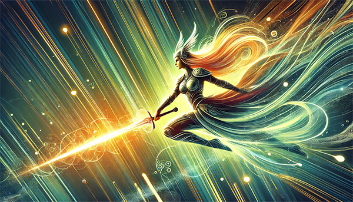

# VueValkyrie

Elevating Heroes, Immortalizing Legends : [vuevalkyrie.com](http://vuevalkyrie.com)

VueValkyrie is an open-source, real-time leaderboard system built with [Vue.js](https://vuejs.org/) and [Valkey](https://valkey.io) (AWS's Redis fork). It will be designed primarily for games and competitive applications. By leveraging Valkey's in-memory data storage and high-speed operations, VueValkyrie enables instant updates and retrieval of leaderboard data, making it ideal for applications requiring real-time ranking and score tracking across millions of users.

## Project Roadmap

For a detailed overview of our development phases, milestones, and future plans, please refer to our [ROADMAP.md](ROADMAP.md) file.

## Project Plan

For a detailed checklist of our milestones and deliverables, please refer to our [PLAN.md](PLAN.md) file.

## Leaderboard Use Cases

Primarily designed for games and competitive applications, but it can be easily applied to other domains:

- Sports Analytics: Real-time stats and rankings for professional leagues (e.g., NFL, NBA, MLB, NHL)
- Education and E-learning: Track student progress and achievements in online courses
- Fitness and Health Tracking: Monitor user rankings for steps taken, calories burned, or workout streaks
- Sales and Marketing Performance: Showcase top performers or most effective marketing campaigns
- Web Analytics: Real-time tracking of website metrics, user engagement, and content performance

## Valkey: A data store and more

I've selected Valkey primarily for its speed, scalability, and real-time capabilities. 
Additional perks include: 

- **High Performance**: Valkey is designed for speed, ideal for real-time leaderboard updates and score retrievals.
- **Versatile Data Structures**: supports various data types including sorted sets, perfect for managing rankings.
- **In-Memory Processing**: provides low latency for read / write operations, crucial for a leaderboard.
- **Scalability**: runs in a cluster configuration, allowing system to scale as the user base grows.
- **Built-in Replication**: replication features ensure high availability to prevent leaderboard downtime.
- **Lua Scripting Support**: Complex operations can be optimized via Lua scripting capabilities.
- **Active Community**: vibrant open-source community ensures ongoing development and support.
- **Compatibility**: Redis fork maintains compatibility with existing clients and tools; win.

## Vue.js: The Progressive JavaScript Framework

I've been building apps with Vue.js for the past 4 years, and think it's a great choice for this project. Specific benefits include:

- **Best of Both Worlds**: Combines Angular's structure with React's flexibility.
- **Performance**: Lightweight with efficient rendering for fast, responsive leaderboards.
- **Reactive Data Binding**: Keeps UI in sync with data, perfect for real-time updates.
- **Composition API**: Improves code organization and reusability.
- **TypeScript Support**: Enhances code quality and developer productivity.
- **Vue DevTools**: Powerful debugging and performance tuning.
- **Scalability**: Supports both small and large-scale applications.
- **Easy Learning Curve**: Accessible for new contributors.
- **Strong Ecosystem**: Provides all tools needed for a full-featured SPA.
- **Go API Integration**: Ideal frontend partner for a Go backend.
- **Single-File Components**: Promotes clean, maintainable code structure.
- **Built-in Transition System**: Creates smooth animations for changing leaderboards.

## Key Features to VueValkyrie

1. Real-time Leaderboard Updates
   - WebSocket integration for instant score changes
   - Smooth animations for rank changes

2. Responsive Design
   - Mobile-first approach with desktop enhancements
   - Adaptive layouts for various screen sizes

3. Player Profile Cards
   - Quick view of player stats and achievements
   - Social sharing capabilities

4. Multiple Leaderboard Views
   - Global rankings
   - Friend leaderboards
   - Time-based competitions (daily, weekly, monthly)

5. Search and Filters
   - Find specific players or filter by various criteria

## Initial Product Requirements

The first version of the VueValkyrie product should include: 

1. Valkey's high-speed data operations for real-time updates
2. Scalability for handling many concurrent users and score submissions
3. Caching capabilities for fast leaderboard retrieval
4. Use of Valkey's data structures (sorted sets) for efficient ranking
5. Rate limiting implementation to showcase Valkey's utility in API protection

## Future Expansion

In future iterations, we can expand this prototype with features like:

- Player profiles
- Multiple leaderboards
- Time-based competitions

These additional features would further explore Valkey's capabilities and showcase its versatility in game development scenarios.

The end result should be useful for game developers, hobbyists, and projects that require high-performance web applications.
   
## Technical Details

On the front-end, VueValkyrie will offer a responsive Single Page Application (SPA) designed for optimal performance across both mobile and desktop browsers. The UX would include a simple interface to display the leaderboard and allow score submissions. In addition, the demo will showcase real-time updates as scores change.

### Front-end Architecture & Stack

- **Vue3 + Composition API**: Leveraging the latest Vue features for efficient, scalable component design.
- **Pinia**: State management solution for Vue, providing a smooth and reactive data flow.
- **PiniaColada**: additional layer that works on top of Pinia, specifically focusing on data fetching and caching. Inspired by React Query but designed to work seamlessly with Pinia and Vue 3. data flow with additional features like automatic persistence and simplified setup.
- **Vite**: Next-generation frontend tooling for fast development and optimized production builds.
- **TypeScript**: Enhancing code quality and developer experience with static typing.
- **Tailwind CSS**: Utility-first CSS framework for creating a responsive, customizable UI.
- **Cypress**: End-to-end testing framework for robust, reliable automated testing of web applications. Cypress provides a powerful set of features for writing, running, and debugging tests that simulate real user interactions, ensuring the application works correctly from the user's perspective.
- **Vitest**: Fast and lightweight unit testing framework for Vite projects. We'll use it for unit and component tests due to its speed, ESM support, and seamless integration with the Vue ecosystem, allowing for efficient and effective testing of Vue components and application logic.

### Leaderboard Logic
- Implement a sorted set in Valkey to maintain the leaderboard.
- Use Valkey's atomic operations for accurate, concurrent score updates.

### Caching
- Cache frequently accessed leaderboard segments in Valkey for fast retrieval.

### Real-time Updates
- Implement a WebSocket connection to push leaderboard changes to connected clients.

### Rate Limiting
- Use Valkey to implement rate limiting on score submissions to prevent cheating.

## Tech Stack Details
General overview of the basic stack, more details will emerge in time...
- Frontend:
  - Vue 3
  - TypeScript
  - Pinia (for state management)
  - Vite (for build tooling)
- Backend:
  - Go
  - Huma (for API development)
- Database:
  - Valkey (AWS's Redis fork)
- Cloud Infrastructure:
  - AWS (EC2 or ECS for hosting)
  - Amazon ElastiCache for Valkey
  - S3 (for static asset hosting)
- CI/CD:
  - GitHub Actions
- Additional:
  - WebSocket (for real-time updates)
  - Docker (for containerization)

## Contributors

VueValkyrie welcomes contributions from the open-source gaming community! This project aims to provide a robust, scalable leaderboard solution that game developers can easily integrate into their projects.

### How You Can Contribute

1. **Feature Development**: Add new features or enhance existing ones.
2. **Bug Fixes**: Help identify and resolve issues.
3. **Documentation**: Improve our docs to help others integrate VueValkyrie.
4. **Testing**: Expand our test coverage and improve test scenarios.
5. **Performance Optimization**: Help make VueValkyrie even faster and more efficient.

### Benefits for the Gaming Community

- **Open-Source Advantage**: Free, customizable leaderboard solution.
- **Learning Opportunity**: Great project for developers to learn modern web technologies.
- **Community-Driven**: Features and improvements guided by real-world needs.
- **Integration Ready**: Easily adaptable for various game types and platforms.

## Roadmap

### Initial Prototype Features
We will focus on the following features for Phase 1 prototype 
- Real-time updates using WebSockets
- Efficient data management with Valkey
- Responsive Vue 3 frontend with TypeScript
- Scalable Go backend using Huma
- Easy deployment on AWS infrastructure

### Release Milestones
  1. Launch the npm package with core features.
  2. Develop a hosted version for enterprises (e.g., leaderboard-as-a-service).
  3. Expand into additional SDKs (Ruby, Flutter, Lua) based on developer interest.
  
### Future Features
 Integrate with **blockchain** or NFT-based systems for gamified economies or decentralized scoring systems.

For a detailed breakdown of our development phases and upcoming features, please check our [Roadmap](ROADMAP.md).

## The origin of VueValkyrie

VueValkyrie combines three powerful elements: Vue, the progressive JavaScript framework, Valkey, AWS's high-performance Redis fork, and the concept of Valkyries from Norse mythology. The name reflects the project's core technologies and aspirations:

1. **Vue**: Represents our use of the [Vue.js](https://vuejs.org/) framework, known for its simplicity, flexibility, and performance in building user interfaces.

2. **Valkey**: Symbolizes our utilization of [Valkey](https://valkey.io), AWS's Redis fork, designed for high-performance, scalability, and real-time data processing capabilities. It provides the robust backend infrastructure necessary for handling large-scale leaderboard operations.

3. **Valkyrie**: Inspired by the formidable female warriors of [Norse legend](https://en.wikipedia.org/wiki/Valkyrie), chosen by Odin to select the most worthy warriors for Valhalla. This symbolizes our leaderboard system's ability to:
   - Select and showcase top performers (like Valkyries choosing the best warriors)
   - Provide swift, real-time updates (mirroring the Valkyries' speed and agility)
   - Offer a robust and reliable system (echoing the Valkyries' strength and dependability)

The combination "VueValkyrie" embodies our vision of a powerful, efficient, and discerning leaderboard system. It represents our commitment to:
- Swiftly process and display data (Vue's reactivity + Valkey's speed + Valkyries' swiftness)
- Accurately rank and showcase top performers (Valkyries' selective nature + Valkey's sorting capabilities)
- Provide a scalable and resilient system (Valkyries' strength + Vue's flexibility + Valkey's scalability)

Just as Valkyries were essential in Norse mythology for recognizing and elevating the most valiant, VueValkyrie aims to be an indispensable tool for game developers in highlighting and celebrating their players' achievements, powered by the robust combination of Vue and Valkey.

## Author

The VueValkyrie project was conceptualized on the evening of October 12, 2024 by [zanuka](https://github.com/zanuka) and will be in active development with the goal of launching Phase 1 by January 2025. Stay tuned!

For inquiries or collaborations, please reach out via:
- GitHub: [@zanuka](https://github.com/zanuka)
- LinkedIn: [Mike Delucchi](https://www.linkedin.com/in/zanuka)
- Email: dev@zanuka.io
- Project Site:  [vuevalkyrie.com](http://vuevalkyrie.com)

## Artwork

The captivating artwork featured in this project was generated using DALL-E, powered by [OpenAI](https://www.openai.com/)'s [ChatGPT-4](https://openai.com/chatgpt). These AI-generated images beautifully capture the essence of VueValkyrie, blending Norse mythology with modern technology.

