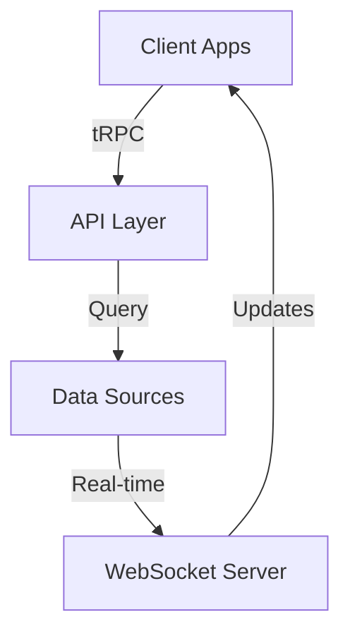
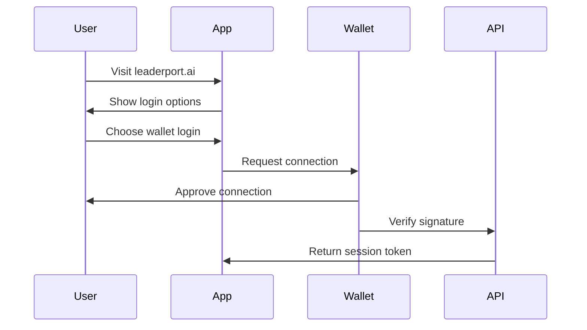

# LeaderPort Platform Strategy

## Overview
LeaderPort will evolve into a comprehensive platform with three main delivery channels:
1. Web Application (leaderport.ai)
2. Browser Extensions
3. Mobile Applications

## Core Architecture Principles

### 1. Monorepo Structure
```
leaderport/
├── packages/
│   ├── core/                 # Shared business logic
│   │   ├── leaderboard/
│   │   ├── analytics/
│   │   └── types/
│   ├── ui/                   # Shared UI components
│   │   ├── components/
│   │   └── hooks/
│   └── api/                  # API interfaces
├── apps/
│   ├── web/                  # Next.js web application
│   ├── extension/            # Browser extension
│   └── mobile/              # React Native app
└── tools/                   # Shared development tools
```

### 2. Technology Stack Selection

#### Web Application (Primary Focus)
- **Framework**: Next.js 14
  - Benefits:
    - Server-side rendering for better SEO
    - App Router for modern routing
    - Built-in API routes
    - Excellent TypeScript support
    - Vercel deployment optimization

#### Shared Core
- **State Management**: TanStack Query + Zustand
- **UI Components**: Radix UI + Tailwind
- **API Layer**: tRPC
- **Type Safety**: TypeScript
- **Testing**: Vitest + Testing Library

## Implementation Phases

### Phase 1: Web Application Foundation
1. **Initial Setup**
   ```typescript
   // apps/web/app/page.tsx
   export default function Home() {
     return (
       <main>
         <section className="hero">
           <h1>Welcome to LeaderPort</h1>
           <div className="cta-container">
             <ConnectWalletButton />
             <Link href="/leaderboard">View Public Leaderboards</Link>
           </div>
         </section>
       </main>
     );
   }
   ```

2. **Core Routes**
   ```
   /                   # Home with login/public options
   /leaderboard        # Public leaderboard view
   /connect            # Wallet connection flow
   /dashboard          # Authenticated user dashboard
   ```

3. **Shared Component Architecture**
   ```typescript
   // packages/ui/components/LeaderboardView/index.tsx
   export interface LeaderboardViewProps {
     data: LeaderboardData;
     isAuthenticated?: boolean;
     onScoreSelect?: (score: Score) => void;
   }

   export function LeaderboardView({
     data,
     isAuthenticated,
     onScoreSelect
   }: LeaderboardViewProps) {
     // Shared leaderboard UI logic
   }
   ```

### Phase 2: Extension Integration
- Reuse core components
- Implement extension-specific views
- Share authentication state

### Phase 3: Mobile Development
- Leverage shared business logic
- Implement React Native UI components
- Maintain consistent user experience

## Data Flow Architecture



## Authentication Flow



## Immediate Next Steps

1. **Project Setup**
   ```bash
   # Initialize monorepo
   pnpm init
   pnpm add -D turbo

   # Create Next.js web app
   cd apps
   pnpm create next-app web
   ```

2. **Core Package Development**
   - Implement shared types
   - Create base UI components
   - Set up authentication flows

3. **Web Application Development**
   - Build home page with dual path
   - Implement public leaderboard view
   - Create wallet connection flow

## Technical Considerations

1. **Code Sharing Strategy**
   - Use TypeScript path aliases
   - Implement barrel exports
   - Maintain clear boundaries

2. **State Management**
   ```typescript
   // packages/core/state/leaderboard.ts
   export const useLeaderboardStore = create<LeaderboardState>((set) => ({
     scores: [],
     filters: defaultFilters,
     setScores: (scores) => set({ scores }),
     updateFilters: (filters) => set({ filters })
   }));
   ```

3. **API Design**
   ```typescript
   // packages/api/router.ts
   export const appRouter = createTRPCRouter({
     leaderboard: leaderboardRouter,
     auth: authRouter,
     scores: scoresRouter
   });
   ```

## Deployment Strategy

1. **Web Application**
   - Deploy to Vercel
   - Configure preview deployments
   - Set up monitoring

2. **Browser Extension**
   - Chrome Web Store deployment
   - Firefox Add-ons deployment
   - Automated builds

3. **Mobile Application**
   - App Store deployment
   - Play Store deployment
   - Beta testing channels
```
